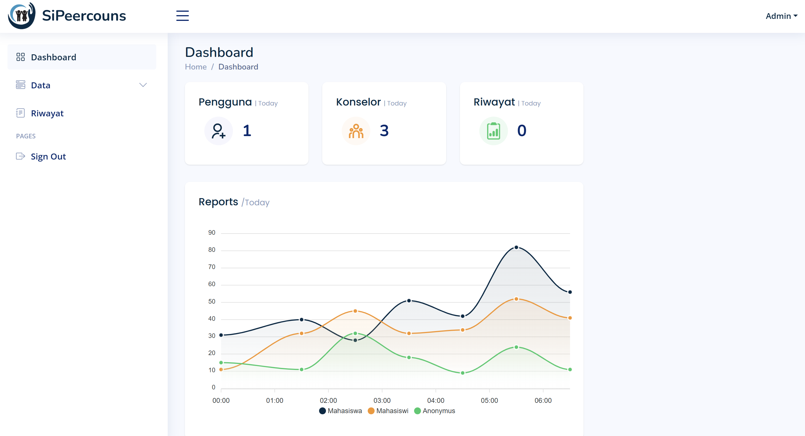
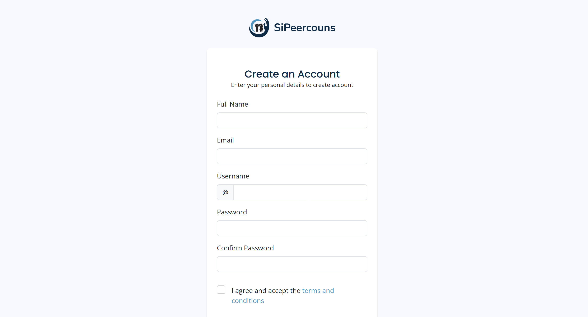

# SiPerCouns - Platform Peer Counseling Mahasiswa

Selamat datang di repository **SiPerCouns**, platform peer counseling berbasis web yang ditujukan untuk membantu mahasiswa/mahasiswi dalam mendapatkan layanan konseling secara lebih mudah, nyaman, dan interaktif.

## Fitur Utama

### Admin
Sebagai **Admin**, Anda bisa:

- Melihat statistik jumlah pengguna, konselor, dan total riwayat konsultasi
- Mengelola data pengguna dan data konselor
- Melihat seluruh riwayat konsultasi yang pernah terjadi

**Preview Halaman Admin:**
<p align="center">
  
</p>

### Konselor
Sebagai **Konselor**, Anda dapat:

- Melihat jumlah pengguna, konsultasi masuk, dan konsultasi yang telah diselesaikan
- Mengelola daftar konsultasi
- Menulis dan mengelola artikel informasi
- Menggunakan fitur Live Chat untuk komunikasi real-time
- Melihat riwayat konsultasi
- Mengelola profil pribadi

**Preview Halaman Konselor:**
<p align="center">
  
</p>

### Mahasiswa / Pengguna
Sebagai **Mahasiswa**, Anda memiliki beberapa fitur utama:

- Melakukan konsultasi dengan konselor pilihan atau secara anonim
- Menggunakan fitur Live Chat
- Melihat riwayat konsultasi sebelumnya
- Mengakses artikel yang dibuat konselor
- Mengelola profil pribadi

**Preview Halaman Pengguna:**

| Fitur | Preview |
|---|---|
| Login |  |
| Register |  |
| Home |  |
| Konseling |  |
| Live Chat |  |
| Riwayat |  |
| Profile |  |

## Teknologi yang Digunakan

- **PHP (Laravel Framework)**
- **MySQL** (Database)
- **HTML / CSS / JavaScript**
- **Bootstrap** (Frontend Framework)
- **AJAX / WebSocket** (Untuk Live Chat Real-Time)

## Rencana Pengembangan Selanjutnya (Future Improvements)

Beberapa fitur tambahan yang direncanakan untuk dikembangkan:

### Dashboard Statistik Lebih Detail
- **Grafik Demografi Pengguna:**  
  Menampilkan perbandingan jumlah mahasiswa, mahasiswi, dan pengguna anonymous yang melakukan konsultasi.

- **Tren Konsultasi Periode Tertentu:**  
  Menampilkan grafik jumlah konsultasi berdasarkan rentang waktu, seperti per bulan atau per semester.

- **Kategori Permasalahan Terbanyak:**  
  Menunjukkan jenis-jenis masalah atau topik yang paling sering dikonsultasikan.

### Notifikasi Real-Time
Notifikasi langsung untuk:
- Konselor (jika ada konsultasi baru atau pesan masuk)
- Admin (untuk monitoring aktivitas konseling)

### Feedback & Rating Konseling
- Mahasiswa dapat memberikan **feedback** atau **penilaian** terhadap sesi konseling yang sudah dilakukan.
- Konselor dapat melihat feedback dari mahasiswa untuk meningkatkan kualitas layanan.

### Export Data Riwayat
Fitur untuk meng-export data riwayat konsultasi ke dalam format:
- **CSV**
- **PDF**

Sehingga admin dapat dengan mudah melakukan dokumentasi atau analisis data.

### Scheduling System
- Konselor dapat membuat dan mengatur **jadwal slot konsultasi**.
- Mahasiswa bisa melakukan **booking jadwal** sesuai waktu yang tersedia.

### Multi Language Support
- Dukungan tampilan aplikasi dalam **multi bahasa**, seperti:
  - **Bahasa Indonesia**
  - **English**
- Pengguna bisa memilih bahasa sesuai preferensi.

## Cara Instalasi

```bash

git clone https://github.com/moccalatt3/-SiPerCouns-Platform-Peer-Counseling-Mahasiswa.git
composer install
cp .env.example .env
php artisan key:generate
php artisan migrate
php artisan serve
